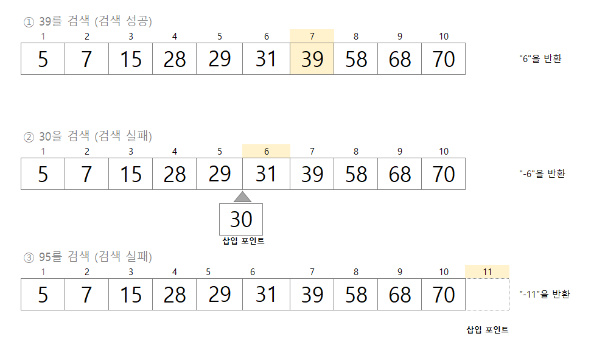

# Arrays.binarySearch에 의한 이진 검색
- 이진 검색 표준 라이브러리의 메서드로는 java.util.Arrays 클래스의 binarySearch 메서드가 존재한다.
- binarySearch 메서드의 장점
  - 장점1. 이진 검색 메서드를 직접 코딩할 필요가 없다.
  - 장점2. 모든 자료형 배열에서 검색할 수 있다.
  - 관련 API 문서 찾아보기 : https://docs.oracle.com/javase/8/docs/api/
  
- BinarySearch 메서드는 오름차순으로 정렬된 배열 a를 가정하고, 키값이 key인 요소를 이진 검색한다.

### binarySearch 메서드는 자료형에 따라 9가지 방법으로 오버로딩 되어있다.
```java
1. static int binarySearch(byte[] a, byte key)
2. static int binarySearch(char[] a, char key)
3. static int binarySearch(double[] a, double key)
4. static int binarySearch(float[] a, float key)
5. static int binarySearch(int[] a, int key)
6. static int binarySearch(long[] a, long key)
7. static int binarySearch(short[] a, short key)
8. static int binarySearch(Object[] a, Object key)
9. static int binarySearch(T[] a, T key, Comparator <? super T > c)
```

### 검색에 성공한 경우
- key와 일치하는 요소의 인덱스를 반환한다.
- 일치하는 요소가 여러 개 있다면 무작위의 인덱스를 반환한다.
- 맨 앞의 인덱스나 어떤 특정한 인덱스를 반환하는 것은 아니다.

### 검색에 실패한 경우
- 반환값은 삽입 포인트를 x라고 할떄, -(x + 1)을 반환한다.
- **삽입 포인트**는 검색하기 위해 지정한 key보다 큰 요소 중 첫번쨰 요소의 인덱스이다.


위 그림은 Arrays.binarySearch 메서드로 검색하는 모든 경우를 나타냈다.

> 1) 39를 검색하면 배열 안에 존재하기 때문에 검색성공이다. 해당 인덱스(6)을 반환한다.
> 2) 30을 검색하면 배열 안에 존재하지 않기 때문에 검색실패이다. 삽입포인트 인덱스는 5이다. -6을 반환. 
> 3) 95를 검색하면 배열 안에 존재하지 않고 모든 요소가 검색하는 값보다 작기 때문에 삽입포인트는 10이다. -11을 반환한다.