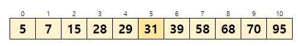
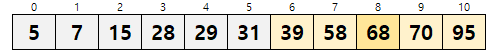
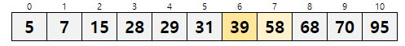

# 이진 검색

- 해당 알고리즘을 적용하는 전제 조건은 데이터가 키 값으로 이미 정렬(sort)되어있다는 점이다.
- 선형검색(linear search)보다 조금 더 빠르게 검색할 수 있다는 장점이 있다.
- 요소가 오름차순 또는 내림차순으로 정렬된 배열에서 검색하는 알고리즘이다.

아래 그림에서 오름차순으로 정렬된 데이터에서 39를 검색하는 과정을 생각해보자.
### 1. 배열의 중앙에 위치한 요소인 a[5]부터 검색을 시작한다.   

- 검색하려는 값인 39는 중앙요소(a[5])보다 큰 값이다.
- 그러므로 검색대상을 뒤쪽 5개로 좁힐 수 있다.
 
### 2. 검색범위의 중앙에 위치한 요소인 a[8]이 원하는 값인지 확인한다.

- 검색하려는 값인 39보다 큰값이다.
- 따라서 검색대상을 앞쪽의 2개로 좁힐 수 있다.

### 3. 검색해야하는 대상이 2개일 경우 앞쪽의 값을 선택하여 원하는 값인지 확인한다.

   
- 원하는 키의 값과 일치하므로 검색 성공이다.

pl : 검색 범위의 맨 앞 인덱스 
pr : 검색 범위의 맨 끝 인덱스
pc : 검색 범위의 중앙 인덱스

