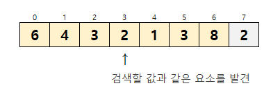
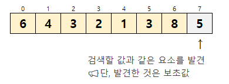

# 선형검색

---
- 배열에서 검색하는 방법 가운데 가장 기본적인 알고리즘이다.
- 요소가 직선으로 늘어선 배열에서의 검색은 원하는 키 값을 갖는 요소를 만날때까지 맨 앞부터 순서대로 요소를 검색하면 된다.
- 선형검색(linear search), 순차검색(sequential search)으로도 불린다.
---
## 선형검색 or 순차 검색 

- 배열 : | 6 | 4 | 3 | 2 | 1 | 3 | 8 |
- 검색할 값 : 2

①. 첫번째  인덱스[0], 요소 6을 선택합니다. 원하는 값이 없습니다. <br>
②. 두번째  인덱스[1], 요소 4을 선택합니다. 원하는 값이 없습니다. <br>
③. 세번째  인덱스[2], 요소 3을 선택합니다. 원하는 값이 없습니다. <br>
④. 네번째  인덱스[3], 요소 2을 선택합니다. 원하는 값입니다. 검색 성공!

위 경우에는 검색에 성공한 사례이다.

만약 값이 배열에 존재하지 않는다면, 선형(linear search) 알고리즘은 배열의 끝까지 수행한다.

---
## 배열 검색의 종료 조건 2가지
> 1. 검색할 값을 발견하지 못하고 배열의 끝을 지나간 경우
> 2. 검색할 값과 같은 요소를 발견한 경우

요솟수가 n개일 때, 원하는 값이 배열에 존재하지 않는 경우  
- 1번은 n + 1회
- 2번은 n회가 된다.
---
```java
package chap03;

import java.util.Scanner;

//선형검색
public class SeqSearch {
    // 요솟수가 n인 배열 a에서 key와 같은 요소를 선형검색합니다.
    static int seqSearch(int[] a, int n, int key) {
        // While 문 활용
    /*
        int i = 0;

        while(true) {
            if (i==n)
                return -1;
            if (a[i] == key)
                return i;
            i++;
        }
    */
        // for문 활용
        for (int i = 0; i < n; i++) {
            if (a[i] == key) {
                return i;
            }
        }
        return -1;
    }

    public static void main(String[] args) {
        Scanner stdIn = new Scanner(System.in);

        System.out.print("요솟수: ");
        int num = stdIn.nextInt();
        int[] x = new int[num];

        for (int i = 0; i < num; i++) {
            System.out.printf("x[%d]: ", i);
            x[i] = stdIn.nextInt();
        }

        System.out.print("검색할 값 : ");
        int key = stdIn.nextInt();
        int idx = seqSearch(x, num, key);

        if (idx == -1)
            System.out.println("해당 값이 없습니다.");
        else
            System.out.println(key + "은(는) x[" + idx + "]에 있습니다.");
    }
}

```
## 보초법(sentinel method)

- 종료 비용을 반으로 줄이는 방법

---

① 검색할 값 : 2 , 검색성공  


② 검색할 값 : 5 , 검색실패(단, 보초값으로 발견)   


- 검색하기 전에 검색하고자 하는 키 값을 맨끝 요소 a[7]에 저장한다.
- 이때 저장하는 값을 보초(sentinel)라고 한다.

> 1: 2를 검색하기 위해 보초로 a[7]에 2를 저장한다.  
> 2: 5를 검색하기 위해 보초로 a[7]에 5를 저장한다.

- 원하는 값이 원래의 데이터에 존재하지 않아도 보초인 a[7]까지 검색하면 종료조건 2가 성립한다.
- 이렇게 하면 원하는 키값을 찾지 못했을때를 판단하는 종료 조건 1이 없어도 된다.
- 보초는 반복문에서 **종료 판단 횟수**를 2회에서 1회로 줄이는 역할을 한다.

---
```java
package chap03;

import java.util.Scanner;

public class SeqSearchSen {
    static int seqSearchSen(int[] a, int n, int key) {
        int i = 0;

        //보초값
        a[n] = key;

        while (true) {
            if (a[i] == key)
                break;
            i++;
        }

        return i == n ? -1: i;
    }

    public static void main(String[] args) {
        Scanner stdIn = new Scanner(System.in);

        System.out.print("요솟수: ");
        int num = stdIn.nextInt();

        // 보초값을 추가하기 위해 num + 1을 진행한다.
        int[] x = new int[num + 1];

        for (int i = 0; i < num; i++) {
            System.out.printf("x[%d]: ", i);
            x[i] = stdIn.nextInt();
        }

        System.out.print("검색할 값 : ");
        int key = stdIn.nextInt();

        int idx = seqSearchSen(x, num, key);

        if (idx == -1)
            System.out.println("해당 값이 없습니다.");
        else
            System.out.println(key + "은(는) x[" + idx + "]에 있습니다.");
    }
}

```
- 검색할 값 key를 보초로 a[n]에 대입한다.
- 배열 요소를 순서대로 검사한다.
- 이 프로그램에서는 종료조건 1이 필요하지 않기때문에 하나의 if문만 사용함.
- 따라서 반복 종료에 대한 판단횟수는 실제로 절반으로 줄어든다.