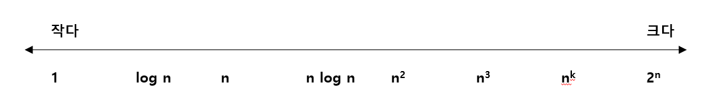

# 복잡도
- 알고리즘의 성능을 객관적으로 평가하는 기준.
---
> 1. 시간 복잡도(time complexity) : 실행에 필요한 시간을 평가한것.
> 2. 공간 복잡도(space complexity) : 기억 영역과 파일 공간이 얼마나 필요한가를 평가한 것.

- 선형 검색과 이진 검색의 시간 복잡도에 대해 자세히 살펴보자.

## 선형 검색의 시간 복잡도
```java
static int seqSearch(int[] a, int n, int key) {
/* 1 */ int i = 0;
/* 2 */ while (i < n) {
/* 3 */     if (a[i] == key)
/* 4 */         return i;       // Successfully search
/* 5 */     i++;
        }
/* 6 */ return -1;              // fail search
}

```

- ①과 ④, ⑤처럼 한번만 실행되는 경우 시간 복잡도는 O(1)로 표기한다.  
- 배열의 맨끝에 도달했는지 판단하는 ②와 현재 검사하고 있는 요소와 찾고자하는 값이 같은지를 판단한는 ③의 평균 실행횟수는 n/2이다.
이처럼 n에 비례하는 횟수만큼 실해아는 경우의 복잡도를 O(n)으로 표기한다.

|단계|실행횟수|복잡도|
|:---:|:---:|:---:|
|1|1|O(1)|
|2| 2/n |O(n)|
|3|2/n |O(n)|
|4|1|O(1)|
|5|2/n |O(n)|
|6|1|O(1)|


- 2개 이상의 복잡도로 구성된 알고리즘의 전체 복잡도는 차원이 더 높은 쪽의 복잡도를 우선시 한다.
- 따라서, 선형 검색 알고리즘의 복잡도는 O(n)이다.

## 이진 검색의 시간 복잡도

```java
    static int binSearch(int[] a, int idx, int key) {
/*1*/   int pl = 0;             // 검색 범위 맨 앞의 인덱스
/*2*/   int pr = idx - 1;       // 검색 범위 맨 끝의 인덱스

        do {
/*3*/       int pc = (pl + pr) / 2;
/*4*/       if (a[pc] == key)
/*5*/           return pc;
/*6*/       else if (a[pc]<key)
/*7*/           pl = pc + 1;
            else
/*8*/           pr = pc -1;
/*9*/   } while(pl <= pr);
/*10*/  return -1;
    }
```

|단계|실행횟수|복잡도|
|:---:|:---:|:---:|
|1| 1 |O(1)|
|2| 1 |O(n)|
|3| log n |O(log n)|
|4| log n |O(log n)|
|5| 1 |O(1)|
|6| 1 |O(1)|
|7| log n |O(log n)|
|8| log n |O(log n)|
|9| log n |O(log n)|
|10| 1 |O(1)|

- 이진 검색 알고리즘의 복잡도를 구하면 아래처럼 O(log n)을 얻을 수 있다.
> O(1) + O(1) + O(log n) + O(log n) + ... + O(1) = O(log n)


### 복잡도의 대소 관계



